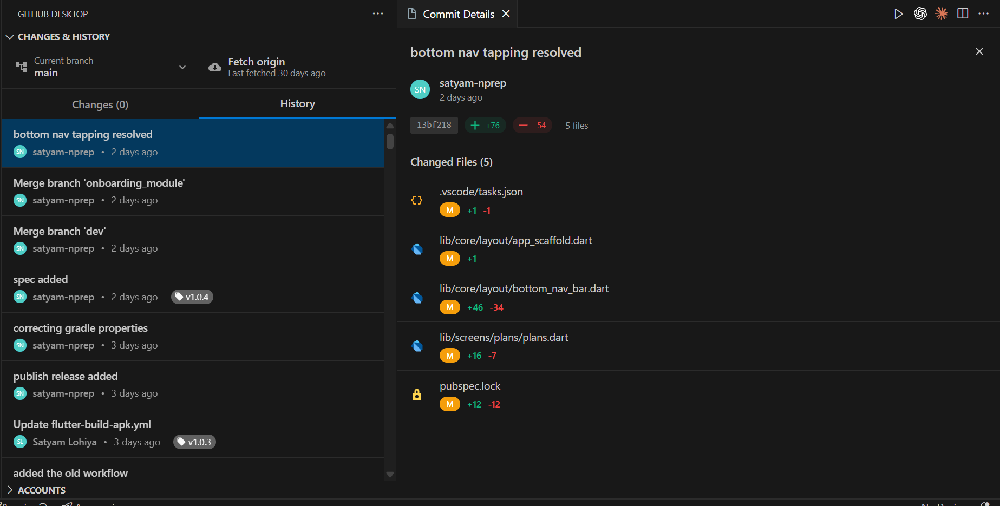
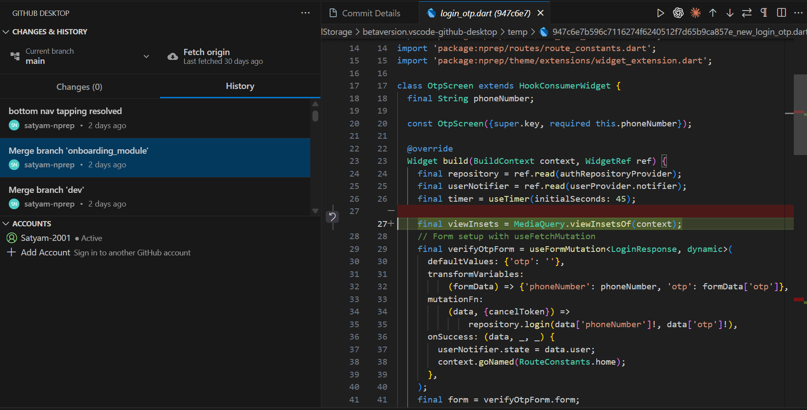

# 🐙 GitHub Desktop for VS Code

<p align="center">
  
</p>

<p align="center">
  <strong>A comprehensive VS Code extension that brings the complete GitHub Desktop experience directly into your editor</strong>
</p>

<p align="center">
  Built with modern React UI components and featuring advanced Git operations, multi-account management, and seamless GitHub integration.
</p>

---

## 📸 Example


### Main Interface


### Timeline and Changes View



---

## ✨ Features

### 🎨 **Modern React-Based Interface**
- **GitHub Desktop-style UI** with clean, responsive design
- **Material-UI components** styled with VS Code theming
- **Avatar integration** with user profile pictures
- **Dark/Light theme** support matching VS Code
- **Responsive layout** that adapts to panel sizes

### 📝 **Advanced Commit Management**
- **Interactive commit history** with detailed commit cards
- **Commit detail panel** opening in separate webview with file changes
- **Right-click context menu** on commits with full Git operations:
  - Reset to commit
  - Checkout commit
  - Revert changes
  - Create branch from commit
  - Create tags
  - Cherry-pick commits
  - Copy SHA/commit info
  - View on GitHub
- **File diff viewer** integrated with VS Code's native diff editor
- **Commit statistics** showing additions/deletions per file

### 🌿 **Branch Operations**
- **Advanced branch dropdown** with grouping (Default/Recent/Other)
- **Branch activity tracking** with last commit dates
- **Branch creation** from any commit
- **Branch merging** with merge dialog
- **Branch switching** with visual feedback

### 👥 **Multi-Account Support**
- **Multiple GitHub accounts** with visual indicators and easy switching
- **Secure token storage** using VS Code Secret Storage API
- **GitHub CLI integration** with automatic account detection
- **One-click account switching** directly from accounts panel
- **Account-specific operations** with proper isolation
- **Smart CLI account selection** with guided switching process

### 🔄 **Repository Management**
- **Auto-detection** of workspace repositories with Git integration
- **Repository cloning** with account selection and progress tracking
- **Private repository** support with proper authentication
- **Repository switching** within VS Code without window changes
- **GitHub integration** for direct repository links and issue creation

### 📱 **Changes & History Panel**
- **VS Code Source Control UI** - Exact replica of native source control
- **Collapsible sections** for staged and unstaged changes
- **File staging/unstaging** with individual file controls
- **Commit message editing** with keyboard shortcuts (Ctrl+Enter)
- **Smart action buttons** (Stage All, Unstage All, Commit, Sync)
- **Real-time updates** with file watching and auto-refresh

### 🎛️ **Timeline Header**
- **Dynamic sync status** showing Push/Pull/Fetch operations
- **Interactive branch switching** with current branch display
- **Sync counters** showing commits ahead/behind
- **Contextual actions** (Force Push, Fetch Origin) when available
- **GitHub Desktop-style layout** with proper spacing and icons

## 🚀 Getting Started

### **Installation & Setup**

#### **📦 For Development**
1. **Clone this repository**
   ```bash
   git clone https://github.com/yourusername/vscode-github-desktop.git
   cd vscode-github-desktop
   ```

2. **Install dependencies**
   ```bash
   npm install
   ```

3. **Build the extension**
   ```bash
   npm run compile && npm run build-webview
   ```

4. **Launch in VS Code**
   - Press `F5` or run `Debug: Start Debugging`
   - A new Extension Development Host window will open

#### **📥 For End Users**
1. **Download from VS Code Marketplace** (coming soon)
2. **Or install via VSIX**:
   - Run `npm run package` to create a `.vsix` file
   - Install using `code --install-extension vscode-github-desktop-1.0.3.vsix`

---

### **🎯 Quick Start Guide**

#### **1. Initial Setup**
1. Open the **GitHub Desktop** view in the activity bar (🐙 icon)
2. Click **"Add Account"** or run `GitHub Desktop: Sign In` command
3. Choose your sign-in method:
   - **Use GitHub CLI** (if `gh` is installed and authenticated)
   - **Enter Personal Access Token** manually
   - **Switch GitHub CLI Account** (for multiple CLI accounts)

> **💡 Pro Tip**: If you have GitHub CLI with multiple accounts, use the "Switch GitHub CLI Account" option to add all your accounts easily!

#### **2. Multi-Account Setup**
1. **First Account**: Follow Initial Setup steps above
2. **Additional Accounts**:
   - Click **"Add Account"** in the Accounts panel
   - For GitHub CLI users with multiple accounts:
     - Select "Switch GitHub CLI Account"
     - Run `gh auth switch` in the opened terminal
     - Select your other account
     - Click "Add Account" again and select "Use GitHub CLI"

#### **3. Working with Repositories**
- **📂 Auto-detection**: Open any Git repository - it's automatically detected
- **📥 Clone new repos**: Use `GitHub Desktop: Clone Repository` for new projects
- **🔄 Switch repositories**: Select from the **Repositories** tree view
- **🌐 Open on GitHub**: Right-click any repository for GitHub shortcuts

#### **4. Daily Git Workflow**

**📝 Making Changes**
- **View changes**: Navigate to the Changes section (styled like VS Code Source Control)
- **Stage files**: Use checkboxes or "Stage All" button
- **Write commits**: Enter commit message and press `Ctrl+Enter` or click "Commit"
- **Push/Pull**: Use the "Sync Changes" button

**📚 Browsing History**
- **Switch to History tab** to see commit timeline with avatars
- **Click any commit** to open detailed file changes in a separate panel
- **Right-click commits** for advanced operations:
  - Reset to commit, Checkout, Revert
  - Create branch from commit, Create tags
  - Cherry-pick, Copy SHA, View on GitHub

**🌿 Branch Operations**
- **Current branch** displayed in timeline header with dropdown arrow
- **Switch branches**: Click the branch name to see branch selector
- **Create branches**: Available in branch dropdown or from commits
- **Merge branches**: Right-click merge option in branch dropdown

#### **5. Advanced Features**
- **🔄 Sync Operations**: Timeline header shows dynamic sync status
- **👥 Account Switching**: Click any account in Accounts panel to switch
- **🎛️ Context Menus**: Right-click commits, branches, files for more options
- **📊 File Diffs**: Integrated with VS Code's native diff viewer

## 📋 Available Commands

| Command | ID | Description | Keyboard Shortcut |
|---------|----|-----------|-------------------|
| **GitHub Desktop: Sign In** | `githubDesktop.signIn` | Sign in with GitHub account | - |
| **GitHub Desktop: Sign Out** | `githubDesktop.signOut` | Sign out from current account | - |
| **GitHub Desktop: Switch Active Account** | `githubDesktop.switchAccount` | Switch between signed-in accounts | - |
| **GitHub Desktop: Switch to Account** | `githubDesktop.switchToAccount` | Switch to specific account (internal) | - |
| **GitHub Desktop: Clone Repository** | `githubDesktop.cloneRepository` | Clone repository with account selection | - |
| **GitHub Desktop: Open Repository** | `githubDesktop.openRepository` | Open repository in current window | - |
| **GitHub Desktop: Create Issue** | `githubDesktop.createIssue` | Create GitHub issue directly | - |
| **GitHub Desktop: Refresh Views** | `githubDesktop.refreshViews` | Force refresh all panels | - |

### **🎨 UI Interactions**
- **Ctrl+Enter** - Commit changes (when in commit message field)
- **Click account** - Switch to that account instantly
- **Right-click commit** - Open context menu with Git operations
- **Click commit** - Open detailed file changes panel
- **Click branch name** - Open branch selector dropdown

---

## ⚙️ Technical Details

### **🏗️ Architecture**
- **Frontend**: React 19 + Material-UI v6 + TypeScript
- **Backend**: VS Code Extension API + Node.js
- **Git Operations**: simple-git library with async/await
- **GitHub API**: @octokit/rest with full authentication
- **Build System**: Vite (webviews) + Webpack (extension)
- **State Management**: React Query + Custom hooks

### **💾 Data Storage**
- **Account metadata**: VS Code global state (workspace-independent)
- **Secure tokens**: VS Code Secret Storage API (encrypted)
- **Repository settings**: Workspace-specific storage
- **GitHub CLI integration**: Automatic token reuse and account detection
- **Cache management**: Intelligent caching with TTL

### **🌐 WebView Integration**
- **Separate webviews**: Main sidebar + commit detail panels
- **VS Code theming**: Full CSS variable integration with automatic theme switching
- **Message bridge**: Secure bidirectional communication between React and extension
- **State persistence**: Maintains state across tab switches and window reloads
- **Performance**: Lazy loading and virtual scrolling for large repositories

### **🔒 Security Features**
- **Token encryption**: All GitHub tokens stored in VS Code Secret Storage
- **Secure communication**: Sandboxed webviews with controlled message passing
- **No token exposure**: Tokens never logged or exposed in UI
- **Account isolation**: Each account's data completely isolated
- **HTTPS enforcement**: All GitHub API calls use HTTPS

---

## 🔧 Configuration

### **📁 File Association**
The extension automatically detects Git repositories in your workspace. No manual configuration required!

### **⚙️ VS Code Settings**
Currently, the extension works out-of-the-box with default settings. Future versions will include:
- Custom themes and layouts
- Keyboard shortcut customization
- Git operation preferences
- Notification settings

### **🔑 GitHub Personal Access Token Requirements**
When using manual token authentication, ensure your token has these scopes:
- `repo` - Full repository access
- `read:org` - Read organization membership
- `workflow` - GitHub Actions workflow access

---

## 🚨 Troubleshooting

### **Common Issues**

**🔐 Authentication Problems**
- Ensure your GitHub token has correct scopes (`repo`, `read:org`, `workflow`)
- For GitHub CLI: Run `gh auth status` to verify authentication
- For multiple CLI accounts: Use `gh auth switch` to change active account

**📂 Repository Not Detected**
- Verify the folder contains a `.git` directory
- Use `GitHub Desktop: Refresh Views` command
- Check if the repository has a remote origin

**🔄 Sync Issues**
- Verify internet connection and GitHub status
- Check if you have push permissions to the repository
- For organization repos, ensure your account has proper access

**🎨 UI/Theme Issues**
- Restart VS Code if themes don't load correctly
- Check VS Code version compatibility (>= 1.84.0)
- Clear VS Code extension cache if needed

### **🐛 Reporting Issues**
1. Check existing [GitHub Issues](https://github.com/yourusername/vscode-github-desktop/issues)
2. Provide VS Code version, OS, and extension version
3. Include steps to reproduce the issue
4. Attach screenshots if UI-related

---

## 🛠️ Development

### **📁 Project Structure**
```
vscode-github-desktop/
├── 📁 src/
│   ├── 📄 extension.ts                    # Main extension entry point
│   ├── 📁 core/
│   │   ├── 📄 accounts/account-manager.ts # Multi-account management
│   │   └── 📄 repositories/               # Repository management
│   ├── 📁 webviews/
│   │   ├── 📄 timeline/                   # Main sidebar webview provider
│   │   ├── 📄 commitDetail/               # Commit detail webview provider
│   │   └── 📁 app/                        # React application
│   │       ├── 📄 App.tsx                 # Main React app
│   │       ├── 📄 bridge.ts               # VS Code communication bridge
│   │       ├── 📁 components/             # React components
│   │       │   └── 📁 Timeline/           # Timeline-specific components
│   │       ├── 📁 features/               # Feature-based organization
│   │       └── 📁 hooks/                  # Custom React hooks
│   ├── 📁 ui/
│   │   └── 📁 tree-views/                 # Account & repository tree providers
│   └── 📁 shared/                         # Shared types and utilities
├── 📁 out/                                # Compiled extension (TypeScript → JavaScript)
├── 📁 dist/                               # Built webviews (React → Bundled)
├── 📁 media/                              # Extension icons & assets
│   ├── 📄 icon.png                        # Extension icon
│   └── 📁 example/                        # Screenshot examples
└── 📄 package.json                        # Extension manifest & dependencies
```

### **🔨 Build Scripts**
```bash
# Development
npm run compile          # Build extension (Webpack)
npm run build-webview    # Build React webviews (Vite)
npm run watch           # Watch extension changes (auto-rebuild)
npm run watch-webview   # Watch webview changes (auto-rebuild)
npm run dev-webview     # Vite dev server for webviews (HMR)

# Production
npm run vscode:prepublish  # Production build (both extension + webviews)
npm run package           # Create .vsix package file

# Testing & Quality
npm run test             # Run extension tests
npm run lint             # Lint TypeScript code
npm run format           # Format code with Prettier
```

### **🧪 Development Workflow**
1. **Setup**: Run `npm install` to install dependencies
2. **Extension Development**: Use `npm run watch` + `F5` (Debug)
3. **React Development**: Use `npm run watch-webview` for hot reload
4. **Testing**: Open a Git repository in the Extension Development Host
5. **Debugging**: Use VS Code debugger with breakpoints in TypeScript

---

## 🎯 Roadmap

### **🚧 Planned Features**
- [ ] **Pull Request Management** - View, create, review, and manage PRs directly in VS Code
- [ ] **GitHub Notifications** - Integrated notification center for mentions, reviews, issues
- [ ] **Status Checks** - CI/CD pipeline status integration with workflow logs
- [ ] **Stash Management** - Git stash operations with UI for saving/applying changes
- [ ] **Conflict Resolution** - Visual merge conflict resolution with 3-way diff
- [ ] **GitHub Actions** - Workflow status, logs, and re-run capabilities
- [ ] **Repository Insights** - Contribution graphs, statistics, and analytics
- [ ] **Team Collaboration** - @mentions, assignees, and team-specific features
- [ ] **Advanced Git Operations** - Interactive rebase, cherry-pick multiple commits
- [ ] **Performance Optimization** - Virtual scrolling, lazy loading for large repos

### **✅ Completed Features**
- [x] **React-based modern UI** with Material-UI components
- [x] **Commit history with avatars** and GitHub user integration
- [x] **Right-click context menus** for all Git operations
- [x] **Commit detail panels** with file diffs and change overview
- [x] **Advanced branch management** with activity tracking and grouping
- [x] **Multi-account support** with secure token storage
- [x] **File diff integration** using VS Code's native diff viewer
- [x] **Repository auto-detection** and workspace integration
- [x] **VS Code theme integration** with full CSS variable support
- [x] **GitHub CLI integration** with automatic account detection
- [x] **Timeline header** with dynamic sync status and operations
- [x] **Source Control UI replica** matching VS Code's native interface

---

## 🏆 Comparison with Other Extensions

| Feature | GitHub Desktop for VS Code | GitLens | GitHub Pull Requests |
|---------|----------------------------|---------|---------------------|
| **UI Style** | GitHub Desktop replica | Overlay annotations | Native VS Code panels |
| **Multi-Account** | ✅ Full support | ❌ Single account | ❌ Single account |
| **Commit History** | ✅ Visual timeline | ✅ File-based history | ❌ Limited |
| **Branch Management** | ✅ Advanced dropdown | ✅ Command palette | ❌ Basic |
| **Pull Requests** | 🚧 Planned | ❌ View only | ✅ Full management |
| **File Staging** | ✅ VS Code style | ❌ Command-based | ❌ Limited |
| **GitHub Integration** | ✅ Full API integration | ✅ Read-only mostly | ✅ Full PR integration |

---

## 🤝 Contributing

We welcome contributions from the community! Here's how you can help:

### **🐛 Bug Reports**
1. Check [existing issues](https://github.com/yourusername/vscode-github-desktop/issues) first
2. Use the bug report template
3. Include VS Code version, OS, and steps to reproduce
4. Add screenshots for UI-related issues

### **💡 Feature Requests**
1. Check the [roadmap](#-roadmap) and existing issues
2. Use the feature request template
3. Explain the use case and expected behavior
4. Consider contributing the implementation!

### **🛠️ Development Contributions**
1. **Fork the repository**
   ```bash
   git clone https://github.com/yourusername/vscode-github-desktop.git
   cd vscode-github-desktop
   ```

2. **Create your feature branch**
   ```bash
   git checkout -b feature/amazing-feature
   ```

3. **Set up development environment**
   ```bash
   npm install
   npm run watch & npm run watch-webview
   ```

4. **Make your changes**
   - Follow TypeScript best practices
   - Add tests for new functionality
   - Ensure UI matches GitHub Desktop style
   - Test with multiple accounts/repositories

5. **Test thoroughly**
   - Test in Extension Development Host (`F5`)
   - Test with different VS Code themes
   - Test multi-account scenarios
   - Verify all Git operations work

6. **Commit your changes**
   ```bash
   git commit -m 'feat: Add amazing new feature'
   ```

7. **Push and create Pull Request**
   ```bash
   git push origin feature/amazing-feature
   ```

### **📝 Documentation**
- Improve README.md or wiki pages
- Add code comments and JSDoc
- Create usage examples or tutorials
- Translate documentation

### **🎨 Design Contributions**
- UI/UX improvements
- Icon design
- Theme enhancements
- Accessibility improvements

---

## 📞 Support & Community

### **💬 Get Help**
- **🐛 Bug Reports**: [GitHub Issues](https://github.com/yourusername/vscode-github-desktop/issues)
- **💡 Feature Requests**: [GitHub Discussions](https://github.com/yourusername/vscode-github-desktop/discussions)
- **📚 Documentation**: [Wiki](https://github.com/yourusername/vscode-github-desktop/wiki)
- **❓ Questions**: [Discussions Q&A](https://github.com/yourusername/vscode-github-desktop/discussions/categories/q-a)

### **🌟 Show Your Support**
- ⭐ **Star this repository** if you find it useful
- 🔄 **Share** with your developer friends
- 🐦 **Tweet** about your experience
- 📝 **Write a review** on VS Code Marketplace (coming soon)

### **📈 Statistics**
- **Downloads**: Coming to VS Code Marketplace
- **GitHub Stars**: [](https://github.com/yourusername/vscode-github-desktop/stargazers)
- **Issues**: [](https://github.com/yourusername/vscode-github-desktop/issues)
- **Contributors**: [](https://github.com/yourusername/vscode-github-desktop/graphs/contributors)

---

## 📄 License

```
MIT License

Copyright (c) 2024 GitHub Desktop for VS Code Contributors

Permission is hereby granted, free of charge, to any person obtaining a copy
of this software and associated documentation files (the "Software"), to deal
in the Software without restriction, including without limitation the rights
to use, copy, modify, merge, publish, distribute, sublicense, and/or sell
copies of the Software, and to permit persons to whom the Software is
furnished to do so, subject to the following conditions:

The above copyright notice and this permission notice shall be included in all
copies or substantial portions of the Software.

THE SOFTWARE IS PROVIDED "AS IS", WITHOUT WARRANTY OF ANY KIND, EXPRESS OR
IMPLIED, INCLUDING BUT NOT LIMITED TO THE WARRANTIES OF MERCHANTABILITY,
FITNESS FOR A PARTICULAR PURPOSE AND NONINFRINGEMENT. IN NO EVENT SHALL THE
AUTHORS OR COPYRIGHT HOLDERS BE LIABLE FOR ANY CLAIM, DAMAGES OR OTHER
LIABILITY, WHETHER IN AN ACTION OF CONTRACT, TORT OR OTHERWISE, ARISING FROM,
OUT OF OR IN CONNECTION WITH THE SOFTWARE OR THE USE OR OTHER DEALINGS IN THE
SOFTWARE.
```

---

<p align="center">
  <strong>Made with ❤️ for the VS Code and GitHub communities</strong>
</p>

<p align="center">
  <sub>🚀 Happy coding with GitHub Desktop for VS Code! 🚀</sub>
</p>

